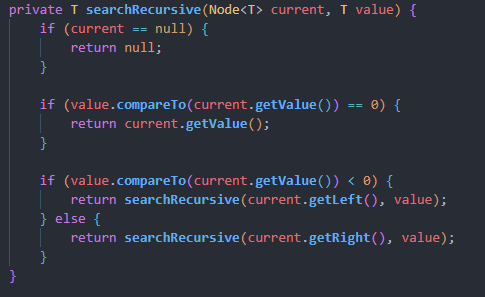
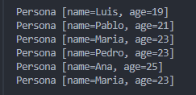

# Práctica: Estructuras No Lineales - 

## Autor
- Nombre: Derlis Yupangui
- Carrera/Curso: Estructura de Datos

##  Nombre de la práctica - Fecha
- Práctica: Interface Comparable
- Fecha: [2026-01-06]

## Descripción
El método compara el valor buscado con el nodo actual usando compareTo: si es igual, lo retorna; si es menor, repite la búsqueda en el hijo izquierdo, y si es mayor, en el derecho, deteniéndose si llega a un nodo nulo.

## Evidencias
### Captura 1

### Captura 2 

##  Nombre de la práctica - Fecha
- Práctica: Graphs
- Fecha: [2026-01-08]

## Descripción
En esta práctica se implementó un grafo no dirigido mediante listas de adyacencia, permitiendo agregar nodos, conectar aristas y mostrar las relaciones entre ellos.

## Evidencias
### Captura 1

